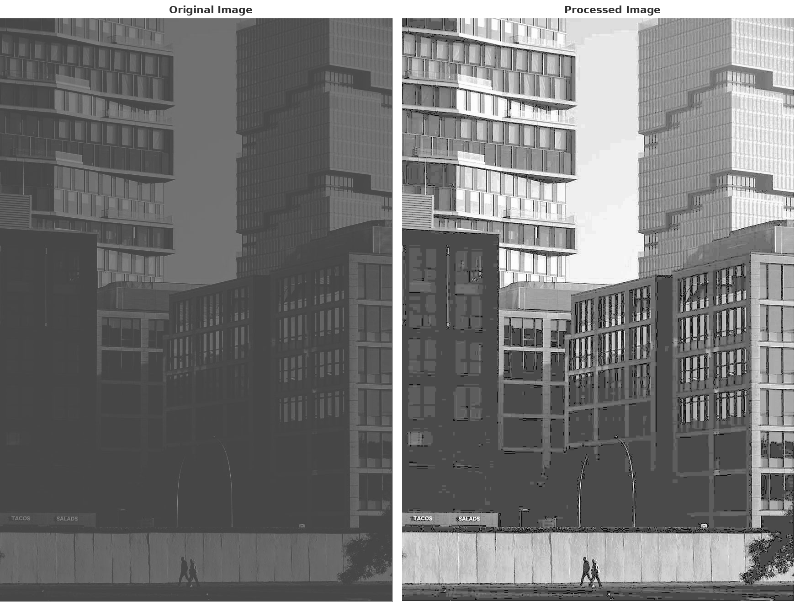
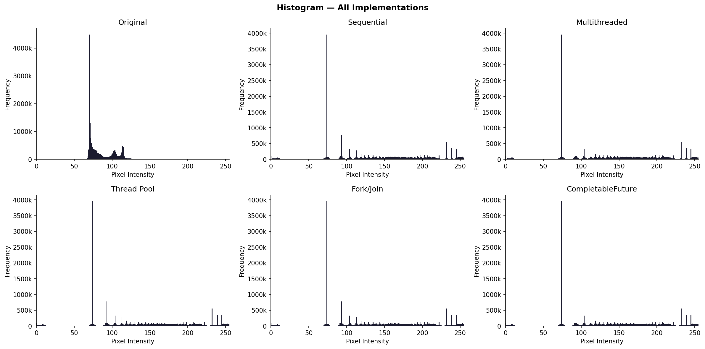
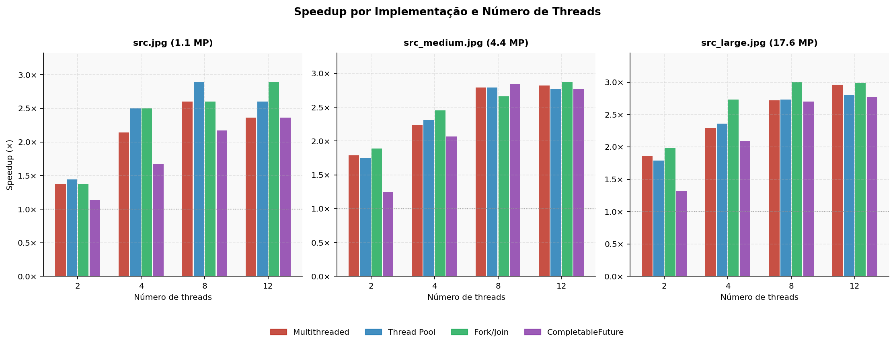
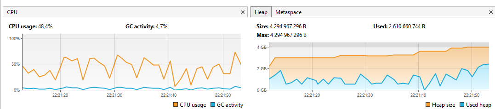

# Relatório do Projeto: Histogram Equalization and Parallel Processing in Java

Sistemas Multinúcleo e Distribuídos - Mestrado em Engenharia Informática, ISEP

**Autor:** Tiago Miguel Silva - 1250554

**Data:** 12/05/2026

**Turma:** M1D

**GitHub repository:** https://github.com/tiagomiguel55/SISMD_project.git

---

## 1. Introdução

A equalização de histograma é uma técnica de processamento de imagem que melhora o contraste de fotografias com pouca nitidez. Quando os píxeis de uma imagem estão todos concentrados numa gama estreita de tons de cinzento, o algoritmo redistribui-os de forma a cobrir toda a escala disponível (de 0 a 255), tornando a imagem visualmente mais nítida e com mais detalhe.

O objetivo deste projeto é implementar este algoritmo em Java e comparar diferentes abordagens de programação paralela, percebendo qual delas processa as imagens mais depressa e porquê. O algoritmo divide-se em três fases: calcular o histograma de luminosidade da imagem, calcular o histograma cumulativo, e transformar cada píxel com base nesse histograma para aumentar o contraste.

As imagens seguintes ilustram o efeito visual da equalização de histograma. À esquerda a imagem original com baixo contraste, à direita a imagem após processamento, com muito mais detalhe e nitidez visíveis.

> **
> **Figura 1:** Imagem original e imagem processada após equalização de histograma.


A figura seguinte mostra os histogramas da imagem original e dos resultados das cinco implementações. Na imagem original, as intensidades estão claramente concentradas entre os valores 60 e 130, com um pico muito pronunciado à volta dos 80, o que confirma o baixo contraste da imagem. Após a equalização, em todas as implementações, a distribuição espalha-se por toda a escala de 0 a 255, ou seja, o resultado esperado. O facto de os cinco histogramas processados serem visualmente idênticos confirma que todas as implementações produzem o mesmo output, independentemente da estratégia de paralelismo ou do mecanismo de sincronização utilizado.

> **
> **Figura 2:** Histograma da imagem original e das cinco implementações após equalização.

---

## 2. Objetivos

O objetivo deste projeto não é apenas fazer o algoritmo funcionar, mas perceber como diferentes estratégias de paralelismo e sincronização afetam o desempenho real. Para isso explorei cinco abordagens diferentes: uma solução sequencial como ponto de comparação, threads manuais sem thread pool com `synchronized`, um thread pool com `ReentrantLock`, Fork/Join com `AtomicInteger[]`, e um pipeline assíncrono com CompletableFuture e `AtomicInteger[]`. Além disso, analisei o impacto de diferentes garbage collectors na performance da aplicação.

---

## 3. Implementações

### 3.1. Solução Sequencial

A solução sequencial é a mais simples e processa todos os píxeis numa única thread, sem qualquer paralelismo. Não tira partido dos múltiplos núcleos da máquina, mas é essencial como referência: é a partir do seu tempo de execução que calculamos o speedup de todas as outras abordagens.

As três fases do algoritmo executam uma a seguir à outra, cada uma dependendo do resultado da anterior. A Fase 1 percorre todos os píxeis e constrói o histograma de luminosidade; a Fase 2 calcula o histograma cumulativo; a Fase 3 transforma cada píxel com base nesse cumulativo.

```java
// Fase 1: histograma de luminosidade
int[] hist = new int[256];
for (int i = 0; i < width; i++)
        for (int j = 0; j < height; j++) {
Color px = tmp[i][j];
hist[computeLuminosity(px.getRed(), px.getGreen(), px.getBlue())]++;
        }

// Fase 2: histograma cumulativo
int[] cumulative = new int[256];
cumulative[0] = hist[0];
        for (int i = 1; i < 256; i++)
cumulative[i] = cumulative[i - 1] + hist[i];

// Fase 3: transformação de cada píxel
        for (int i = 0; i < width; i++)
        for (int j = 0; j < height; j++) {
Color px   = tmp[i][j];
int lum    = computeLuminosity(px.getRed(), px.getGreen(), px.getBlue());
double cdf = (double) cumulative[lum] / (double) (totalPixels - cdfMin);
int newLum = Math.min(255, (int) Math.round(255.0 * cdf));
tmp[i][j]  = new Color(newLum, newLum, newLum);
    }
```

As Fases 1 e 3 são as mais pesadas computacionalmente, pois iteram sobre todos os píxeis da imagem, O(width × height). A Fase 2 opera apenas sobre 256 valores e é negligenciável em termos de tempo. São precisamente as Fases 1 e 3 que vão ser paralelizadas nas implementações seguintes; a Fase 2 mantém-se sempre sequencial porque cada valor do histograma cumulativo depende do anterior.

### 3.2. Solução Multithread (Sem Thread Pool)

Aqui criei e geri as threads manualmente. A imagem é dividida em faixas verticais de colunas e cada thread fica responsável por uma faixa.

Para a sincronização do histograma, cada thread acumula as suas contagens num array local durante o processamento, sem nenhum lock. Só no final, quando termina de processar toda a sua faixa, é que adquire um bloco `synchronized` para fazer o merge com o histograma global. Desta forma, o lock é adquirido apenas uma vez por thread em vez de uma vez por píxel, o que reduz drasticamente a contenção.

```java
// Cada thread acumula localmente...
int[] localHist = new int[256];
for (int i = startX; i < endX; i++)
    for (int j = 0; j < height; j++)
        localHist[computeLuminosity(...)]++;

// ...e só depois faz o merge com synchronized
synchronized (hist) {
    for (int i = 0; i < 256; i++) hist[i] += localHist[i];
}
```

A gestão das threads é explícita: todas são iniciadas com `thread.start()` e o programa aguarda a conclusão de cada uma com `thread.join()` antes de avançar para a fase seguinte. Isto garante que o histograma global está completo antes de calcular o cumulativo, e que todos os píxeis estão transformados antes de devolver o resultado.

```java
for (Thread thread : threads) thread.start();
for (Thread thread : threads) thread.join();
```

O ponto fraco desta abordagem é que as threads são criadas de novo em cada chamada a `processImage()`, o que introduz overhead extra especialmente visível em imagens pequenas.

### 3.3. Solução com Thread Pool

Para resolver o problema anterior, introduzi um `ExecutorService` criado uma única vez no construtor e reutilizado em todas as chamadas. Assim o custo de criar e destruir threads é pago apenas uma vez.

A sincronização passou a ser feita com um `ReentrantLock` em vez de `synchronized`. O `ReentrantLock` é mais flexível, suporta timeout e aquisição interrompível, e garante sempre a libertação do lock através do padrão `try/finally`.

```java
lock.lock();
try {
    for (int i = 0; i < 256; i++) hist[i] += localHist[i];
} finally {
    lock.unlock();
}
```

O tamanho do pool é igual ao número de threads passado como argumento, usando `Executors.newFixedThreadPool(numThreads)`. Com base nos resultados do benchmark, o valor ótimo para este hardware é 8 threads, coincidente com o número de núcleos lógicos do Ryzen 5 4600H. Aumentar além desse ponto não traz ganhos porque o bottleneck passa a ser o acesso à memória e não a disponibilidade de CPU.

### 3.4. Solução com Fork/Join

O Fork/Join divide o trabalho recursivamente. Enquanto a faixa de colunas for maior que 100, divide-se em duas metades e processa-as em paralelo. Quando chega a uma faixa pequena o suficiente, calcula diretamente.

Para a sincronização usei um array de `AtomicInteger`. Quando chega a uma faixa pequena o suficiente para processar diretamente, acumula localmente e no final faz o merge com addAndGet(), uma operação atómica que não precisa de locks explícitos e só contende quando duas tarefas tentam atualizar o mesmo bucket ao mesmo tempo.

```java
int mid = startX + (endX - startX) / 2;
HistogramTask right = new HistogramTask(tmp, mid, endX, height, atomicHist);
right.fork();
new HistogramTask(tmp, startX, mid, height, atomicHist).compute();
right.join();

// Merge atómico no histograma partilhado
for (int i = 0; i < 256; i++)
    if (localHist[i] > 0)
        atomicHist[i].addAndGet(localHist[i]);
```

Uma vantagem do Fork/Join é o work-stealing: quando uma thread acaba a sua parte mais cedo, vai buscar trabalho às filas das outras, mantendo todos os núcleos ocupados.

### 3.5. Solução com CompletableFuture

O CompletableFuture organiza as três fases como um pipeline assíncrono encadeado, cada fase começa automaticamente quando a anterior termina, sem gestão manual de threads.

```java
CompletableFuture
        .supplyAsync(() -> computeHistogramParallel(tmp, width, height), pool)
        .thenApply(hist -> computeCumulativeHistogram(hist))
        .thenApply(cum  -> transformPixelsParallel(tmp, width, height, cum, totalPixels))
        .thenAccept(result -> { })
        .join();
```

O `.join()` no final bloqueia a thread principal até todo o pipeline estar concluído, garantindo que o resultado está disponível antes de devolver a imagem. O encadeamento com `thenApply` trata automaticamente da composição dos resultados: o histograma calculado na `supplyAsync` é passado diretamente ao `thenApply` seguinte que calcula o cumulativo, que por sua vez é passado à transformação de píxeis. Não há gestão manual de dependências entre fases.

Usei `AtomicInteger[]` para a sincronização do histograma da mesma forma que no Fork/Join, o que permite uma comparação justa entre as duas abordagens.

### 3.6. Configuração do Garbage Collector

Em cada chamada a `processImage()`, o programa cria uma cópia completa da imagem e vários arrays temporários por thread. Para a imagem média, isso representa cerca de 4,4 milhões de objetos `Color` que ficam inutilizáveis assim que o método termina, colocando bastante pressão no garbage collector.

Testei três coletores:

| Coletor | Flag JVM | Foco |
|---------|----------|------|
| G1GC (padrão) | `-XX:+UseG1GC` | Pausas baixas e previsíveis |
| Parallel GC | `-XX:+UseParallelGC` | Máximo throughput |
| ZGC | `-XX:+UseZGC` | Latência ultra-baixa (<1 ms) |

Os testes foram realizados com a imagem `src_large.jpg` e 8 threads, que é a configuração que mais pressiona o GC, pois tem maior imagem, mais threads e mais objetos temporários alocados em simultâneo. O G1GC e o Parallel GC correram com `-Xmx4g`, e o ZGC com `-Xmx8g` porque o seu modelo de coleta concorrente mantém mais objetos vivos em memória ao mesmo tempo, precisando de mais espaço disponível.

| Coletor | Coletas | Tempo total GC | Pausas da aplicação |
|---------|---------|---------------|---------------------|
| G1GC | 114 (76 young + 8 concurrent + 30 old) | 8215 ms | Sim (até ~170 ms) |
| Parallel GC | 125 (87 scavenge + 38 marksweep) | 12827 ms | Sim (até ~378 ms) |
| ZGC | 148 (37 cycles + 111 pauses) | 10751 ms | **0 ms** |

Analisando os logs de cada coletor, as diferenças de comportamento são bastante visíveis.

O **G1GC** começa com pausas muito pequenas (3-4 ms nas primeiras coletas Young Generation) e vai crescendo de forma gradual à medida que o heap enche. As Full GC acionadas pelos `System.gc()` explícitos ficaram entre 100 e 172 ms, sempre limpando o heap de cerca de 1,2 GB para 607 MB. É um comportamento previsível e bem distribuído.

```
[G1GC] GC(0) Pause Young (Normal) 76M->55M(512M) 4.074ms
[G1GC] GC(21) Pause Full (System.gc()) 1934M->607M(2054M) 123.663ms
```

O **Parallel GC** tem um comportamento mais agressivo. As pausas crescem rapidamente e o log mostra Full GC por Ergonomics com pausas de 204 ms, 332 ms e até 378 ms, muito maiores que o G1GC. No entanto, este tempo é passado em threads dedicadas que correm em paralelo e o coletor faz menos coletas para limpar mais memória de uma vez, o que maximiza o throughput global.

```
[Parallel] GC(9)  Pause Full (Ergonomics) 1173M->1122M(2653M) 332.100ms
[Parallel] GC(35) Pause Full (Ergonomics) 2244M->933M(2663M) 378.279ms
```

O **ZGC** é o mais diferente de todos. O log não mostra nenhum valor de pausa porque toda a coleta é feita de forma concorrente com a aplicação, daí os 0 ms registados nas estatísticas. Uma particularidade visível no log é que o ZGC chegou a usar até 5,6 GB de heap (69% dos 8 GB disponíveis), bem mais do que os outros dois coletores. Isto acontece porque, ao não parar a aplicação para limpar, o ZGC acumula mais objetos vivos em memória ao mesmo tempo.

```
[ZGC] GC(0)  Garbage Collection (Warmup) 898M(11%)->1022M(12%)
[ZGC] GC(9)  Garbage Collection (System.gc()) 5678M(69%)->1368M(17%)
[ZGC] GC(24) Garbage Collection (System.gc()) 5678M(69%)->1360M(17%)
```

Para uma aplicação como esta, onde o objetivo é processar a imagem do início ao fim o mais depressa possível e sem requisitos de tempo de resposta, o Parallel GC é a escolha mais adequada. O G1GC é uma boa alternativa geral com pausas mais previsíveis. O ZGC faz sentido em aplicações onde parar a execução por milissegundos é inaceitável, mas como se viu nos testes, requer significativamente mais memória disponível.

```bash
java -XX:+UseG1GC       -Xms512m -Xmx4g -Xlog:gc:file=gc_g1.log:time,uptime,level,tags ApplyFilters
java -XX:+UseParallelGC -Xms512m -Xmx4g -Xlog:gc:file=gc_parallel.log:time,uptime,level,tags ApplyFilters
java -XX:+UseZGC        -Xms512m -Xmx8g -Xlog:gc:file=gc_zgc.log:time,uptime,level,tags ApplyFilters
```

---

## 4. Concorrência e Sincronização

Em todas as implementações paralelas tomei a mesma decisão de base: cada thread acumula as suas contagens localmente e só sincroniza no merge final. Isto reduz o número de aquisições de lock de milhões (uma por píxel) para N (uma por thread), tornando a sincronização eficiente sem abdicar dela.

A partir daí, cada implementação usa um mecanismo diferente para esse merge. O `synchronized` nas threads manuais é simples e direto, bloqueia o array inteiro mas apenas uma vez por thread. O `ReentrantLock` no thread pool oferece mais flexibilidade com a garantia de libertação via `try/finally`. O `AtomicInteger[]` no Fork/Join e CompletableFuture permite operações atómicas por bucket sem bloqueio total do array.

A Fase 3 não precisa de nenhuma sincronização em nenhuma das implementações porque cada thread escreve numa faixa de colunas exclusiva, por isso nunca há conflito. A Fase 2 é sempre sequencial porque cada valor do histograma cumulativo depende do anterior, e como são apenas 256 operações, não compensa paralelizar.

---

## 5. Análise de Performance

### Ambiente de Teste

Os testes foram realizados num processador AMD Ryzen 5 4600H, que tem 6 núcleos físicos e 12 threads lógicas via SMT (Simultaneous Multithreading). Este detalhe é relevante para interpretar os resultados: até 6 threads cada uma ocupa um núcleo físico distinto, mas a partir daí as threads passam a partilhar núcleos, o que limita os ganhos de paralelismo.

| Parâmetro | Valor |
|-----------|-------|
| CPU | AMD Ryzen 5 4600H (6 núcleos físicos, 12 threads lógicas) |
| Runs de aquecimento | 3 |
| Runs medidos | 5 |
| Pausa entre runs | `System.gc()` + 50 ms |
| Tamanhos de imagem | 860×1276 (~1,1 MP), 1720×2552 (~4,4 MP), 3440×5104 (~17,6 MP) |
| Threads testadas | 2, 4, 8, 12 |
| JVM | OpenJDK 21, G1GC (padrão) |
| Heap | `-Xms512m -Xmx2g` |
| O que é medido | Apenas `processImage()` sem I/O nem criação do pool |
| Valor reportado | Média das 5 corridas medidas |

### Resultados

#### src.jpg (860 × 1276, ~1,1 MP)

| Threads | Sequencial (ms) | Multithread | Thread Pool | Fork/Join | CompletableFuture |
|:-------:|:--------------:|:-----------:|:-----------:|:---------:|:-----------------:|
| 2  | 26 |  19 ms (1,37×) |  18 ms (1,44×) |  19 ms (1,37×) |  23 ms (1,13×) |
| 4  | 30 |  14 ms (2,14×) |  12 ms (2,50×) |  12 ms (2,50×) |  18 ms (1,67×) |
| 8  | 26 |  10 ms (2,60×) |   9 ms (2,89×) |  10 ms (2,60×) |  12 ms (2,17×) |
| 12 | 26 |  11 ms (2,36×) |  10 ms (2,60×) |   9 ms (2,89×) |  11 ms (2,36×) |

#### src_medium.jpg (1720 × 2552, ~4,4 MP)

| Threads | Sequencial (ms) | Multithread | Thread Pool | Fork/Join | CompletableFuture |
|:-------:|:--------------:|:-----------:|:-----------:|:---------:|:-----------------:|
| 2  | 159 |  89 ms (1,79×) |  91 ms (1,75×) |  84 ms (1,89×) | 127 ms (1,25×) |
| 4  | 157 |  70 ms (2,24×) |  68 ms (2,31×) |  64 ms (2,45×) |  76 ms (2,07×) |
| 8  | 162 |  58 ms (2,79×) |  58 ms (2,79×) |  61 ms (2,66×) |  57 ms (2,84×) |
| 12 | 155 |  55 ms (2,82×) |  56 ms (2,77×) |  54 ms (2,87×) |  56 ms (2,77×) |

#### src_large.jpg (3440 × 5104, ~17,6 MP)

| Threads | Sequencial (ms) | Multithread | Thread Pool | Fork/Join | CompletableFuture |
|:-------:|:--------------:|:-----------:|:-----------:|:---------:|:-----------------:|
| 2  | 650 | 350 ms (1,86×) | 363 ms (1,79×) | 326 ms (1,99×) | 492 ms (1,32×) |
| 4  | 626 | 273 ms (2,29×) | 265 ms (2,36×) | 229 ms (2,73×) | 299 ms (2,09×) |
| 8  | 615 | 226 ms (2,72×) | 225 ms (2,73×) | 205 ms (3,00×) | 228 ms (2,70×) |
| 12 | 621 | 210 ms (2,96×) | 222 ms (2,80×) | 208 ms (2,99×) | 224 ms (2,77×) |

### Gráfico de Speedup

> **
> **Figura 3:** Speedup por implementação e número de threads, para cada tamanho de imagem.

### Utilização de CPU e Memória

Para complementar a análise dos tempos de execução, foram recolhidas métricas de CPU e heap durante o benchmark à imagem `src_large.jpg` com 8 threads, utilizando o VisualVM com o Parallel GC ativo.

> **
> **Figura 4:** Utilização de CPU e heap durante o benchmark (VisualVM, Parallel GC, src_large.jpg, 8 threads).

O gráfico de CPU mostra um uso médio de 48,4%, com oscilações entre 30% e 70% ao longo do benchmark. Esta variação reflete o comportamento das diferentes implementações, ou seja, as paralelas puxam mais CPU do que o sequencial, e as diferenças entre elas são visíveis nos picos. A atividade de GC ficou nos 4,7%, o que confirma que o Parallel GC não interfere significativamente com o processamento.

O gráfico de heap mostra um padrão típico de dente de serra: o heap cresce durante o processamento de cada implementação e desce abruptamente quando o GC faz uma coleta entre runs. O heap size estabilizou nos 4 GB configurados e o used heap oscilou entre 1,5 GB e 2,5 GB, o que mostra que o programa usa intensivamente a memória disponível mas sem a esgotar.

### O que os resultados dizem

#### 5.1. O impacto do tamanho da imagem

O tamanho da imagem dita as regras do jogo.

Na imagem mais pequena (`src.jpg` com 1,1 MP), a execução sequencial já é tão rápida (26 ms) que o trabalho de criar, sincronizar e coordenar threads acaba por atrapalhar mais do que ajudar. O exemplo mais claro disto é a implementação Multithread (Sem Thread Pool): ao passar de 8 para 12 threads, o desempenho piorou e o speedup caiu de 2,60× para 2,36×. Criar 12 threads do zero para uma tarefa tão pequena não compensa o tempo gasto. O Thread Pool lidou muito melhor com isto precisamente porque recicla threads que já estão prontas a usar.

Na imagem média (`src_medium.jpg` com 4,4 MP) o cenário já é mais equilibrado. Com 8 threads, quase todas as implementações convergem para valores muito próximos, entre 2,66× e 2,84×. É aqui que o CompletableFuture surpreende positivamente: com threads suficientes para o pipeline funcionar sem bloqueios, passa a ser o melhor resultado da tabela (2,84×).

Na imagem grande (`src_large.jpg` com 17,6 MP), o tempo gasto a gerir threads dilui-se na enorme quantidade de píxeis a processar. É aqui que o Fork/Join brilha de forma isolada, alcançando 3,00× com 8 threads, o único a ultrapassar essa barreira. Como a imagem é grande, há sempre muitas subtarefas disponíveis para o work-stealing funcionar, garantindo que nenhum núcleo fica parado.

#### 5.2. Como se portou cada implementação?

Olhando para o panorama geral, cada abordagem revelou a sua personalidade própria.

O Fork/Join foi a implementação mais consistente. Liderou nas imagens maiores e provou que dividir o trabalho recursivamente com work-stealing é a melhor abordagem para grandes volumes de dados. O seu único ponto menos forte é nas imagens muito pequenas, onde a divisão recursiva introduz overhead desnecessário para tão poucas colunas.

O Thread Pool foi a opção mais equilibrada para imagens pequenas, resolvendo logo à partida o problema do overhead de criação de threads. A reutilização do pool compensa claramente face às threads manuais.

O Multithread Manual fez o trabalho de forma satisfatória, mas mostrou-se mais instável. É muito sensível ao número de threads lançadas e, como se viu na imagem pequena, criar threads a mais pode piorar o resultado em vez de o melhorar.

O CompletableFuture teve o comportamento mais curioso. Com apenas 2 threads, o peso de gerir todo o pipeline assíncrono colocou-o no último lugar em todas as imagens. Quando lhe foram dadas threads suficientes (8 a 12), o cenário inverteu-se completamente e tornou-se extremamente competitivo, chegando mesmo a liderar na imagem média. É uma implementação que precisa de espaço para respirar.

#### 5.3. O que o hardware nos ensinou

Os resultados são um reflexo direto do processador utilizado, o AMD Ryzen 5 4600H com 6 núcleos físicos e 12 lógicos. O maior salto de performance acontece sempre ao passar de 4 para 8 threads. Isto faz todo o sentido: até às 6 threads estamos a distribuir trabalho por núcleos físicos reais e independentes, e cada thread adicional traz um ganho genuíno.

A partir das 6 threads o processador começa a usar as threads lógicas via SMT. Como estas partilham os mesmos recursos físicos do núcleo principal, o ganho de velocidade diminui bastante. É por isso que de 8 para 12 threads os tempos ficam praticamente iguais em todas as implementações, pois o processador já estava saturado.

#### 5.4. O limite da Lei de Amdahl

Teoricamente, com 8 threads o ideal era ver o programa a correr 8 vezes mais rápido, mas na prática cheguei a uma parede à volta dos 3,00× de speedup.

Isto é a Lei de Amdahl na prática. Por mais threads que se use, o speedup máximo é sempre limitado pelas partes do código que são obrigatoriamente sequenciais. Neste caso, a cópia inicial da imagem e a construção do histograma cumulativo (Fase 2) formam um gargalo que impede o programa de escalar de forma linear. Mesmo que se tentasse paralelizar a Fase 2, o resultado seria pior do que a versão sequencial, pois o histograma cumulativo opera sobre apenas 256 valores e o overhead de lançar e coordenar threads para somar 256 inteiros seria muito maior do que o tempo de os somar sequencialmente. Há situações em que paralelizar simplesmente não compensa, e esta é uma delas.

#### 5.5. Análise de Overhead

O overhead de gestão de threads não é uniforme entre implementações e os resultados do benchmark deixam isso bem claro.

O custo mais óbvio é o de criar threads de raiz. No Multithread sem Thread Pool, em cada chamada a `processImage()` são criadas N threads novas, cada uma com alocação de stack e registo na JVM. Na imagem pequena, onde o sequencial leva apenas 26 ms, este custo chegou a dominar completamente o tempo de execução: ao passar de 8 para 12 threads, o speedup caiu de 2,60× para 2,36×, ou seja, adicionar mais threads piorou o resultado. O Thread Pool resolve exactamente isto. Como o `ExecutorService` é criado uma vez no construtor e reutilizado em todas as chamadas, o custo de criação de threads é pago apenas na inicialização, o que explica o seu melhor desempenho nas imagens pequenas mesmo usando exactamente a mesma lógica de divisão e sincronização.

A sincronização tem um impacto semelhante. A decisão de acumular localmente e sincronizar apenas no merge final reduziu o número de aquisições de lock de O(píxeis) para O(threads), o que na imagem grande com 8 threads representa passar de cerca de 17,6 milhões de tentativas de lock para apenas 8. A diferença entre `synchronized`, `ReentrantLock` e `AtomicInteger[]` é residual a este nível, o que determina a performance é a frequência de sincronização, não o mecanismo escolhido.

O Fork/Join tem o seu próprio overhead: cada `fork()` implica submeter uma tarefa à fila do pool e potencialmente desencadear work-stealing. Nas imagens pequenas, com poucas colunas disponíveis para dividir, este custo é proporcionalmente alto. Nas imagens grandes, onde há sempre muitas subtarefas em fila, o work-stealing mantém todos os núcleos ocupados e o overhead relativo torna-se negligenciável, daí o Fork/Join ser o único a ultrapassar os 3,00× de speedup.

O CompletableFuture é o caso mais extremo. Cada fase do pipeline é submetida como uma tarefa independente, há coordenação entre fases via callbacks, e o custo de orquestrar `supplyAsync`, `thenApply` e `thenAccept` é o maior overhead fixo de todas as implementações. Com apenas 2 threads esse peso domina completamente e o CompletableFuture fica sempre em último lugar. Com 8 threads o overhead dilui-se e a implementação torna-se tão competitiva quanto as restantes, chegando mesmo a liderar na imagem média.

No fundo, o overhead de threading é inversamente proporcional ao tamanho do trabalho por thread. Em imagens pequenas, minimizá-lo vale tanto quanto o paralelismo em si. Em imagens grandes, o que passa a contar é a estratégia de divisão de trabalho.

---

## 6. Conclusões

Este projeto mostrou que paralelizar não chega. A forma como se paraleliza e a estratégia de sincronização fazem toda a diferença. A decisão mais importante foi acumular localmente e sincronizar apenas no merge final, reduzindo o número de aquisições de lock de milhões para N e tornando a sincronização eficiente sem abdicar dela. Sem esta abordagem, o overhead dos locks eliminaria qualquer ganho de paralelismo.

Das cinco abordagens, o Fork/Join foi a mais consistente nas imagens grandes graças ao work-stealing, e o Thread Pool o mais eficiente nas pequenas pela reutilização de threads. O CompletableFuture destacou-se pela legibilidade do código: o pipeline `supplyAsync` seguido de `thenApply` e `thenAccept` expressa claramente as três fases e as suas dependências, mas precisa de threads suficientes para render ao máximo.

O número ideal de threads para esta aplicação foi 8, coincidente com o ponto em que o Ryzen 5 4600H começa a saturar os núcleos físicos disponíveis. Adicionar mais threads além desse ponto trouxe ganhos marginais ou até regressões, o que reforça a importância de ajustar o paralelismo ao hardware real em vez de o maximizar de forma arbitrária.

Para o garbage collector, o Parallel GC revelou-se a melhor escolha para este tipo de aplicação, onde o objetivo é processar a imagem do início ao fim o mais depressa possível e onde há muitos objetos temporários a ser criados e descartados ao longo da execução.